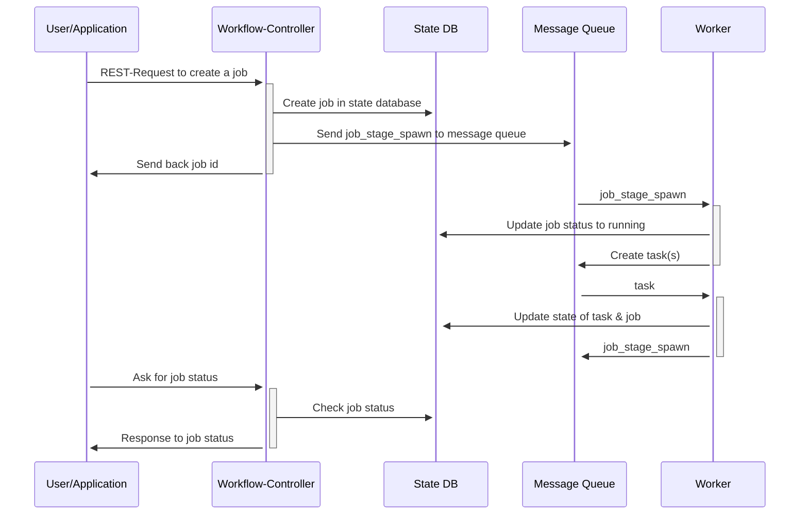

# System Specification

## Software Architecture
The engine is composed of the following components:
- **Controller**: The controller is responsible for providing the external REST interfaces for managing the jobs. It is responsible for creating a job, starting a job, monitoring the progress of a job and finally completing a job.
- **Worker**: The worker is responsible for executing the job and corresponding tasks.
- **Message Queue**: The message queue is used to communicate between the worker and the control instances.
- **Shared Volume**: The shared volume is used to store the input and output of tasks and jobs. Worker consume input for their tasks from the shared volume and write the output of their tasks to the shared volume.

Following the architecture diagram illustrates the components and their interactions:


## Job & Task Description

### Tasks
A task is a simple building block that can be executed by a worker. A task consumes input and produces output. They are oblivious to the job in which they are executed.

The individual tasks are described in a YAML file. The following is an example of a task description:
```yaml
---
  # The list of tasks that can be executed by the job
  tasks:
    # A task that exports and serializes data from a server defined by the given data id.
    export-data:
      description: Exports and serializes the data described by the given id
      # The list of different input parameters that the task can take.
      # An input can be a parameter or an environment variable.
      input:
        data_id:
          description: The id of the data to be exported
          source_type: parameter
        REST_ENDPOINT:
          description: The endpoint of the server
          source_type: environment
        LOG_LEVEL:
          description: The log level
          source_type: environment
      exec_command: serialize_data
      exec_args:
      - "--data_id"
      - "{{data_id}}"
      - "--endpoint"
      - "{{REST_ENDPOINT}}"
      - "--log_level"
      - "{{LOG_LEVEL}}"
    # A special task that creates the spawn.json file that contains the input parameters for the
    # tasks that should be spawned in the second stage.
    spawn_download_tasks:
      description: Creates the spawn.json for the download tasks
      exec_command: python3
      exec_args:
      - "create_download_tasks.py"
    # A task that downloads a single file from a given url
    download:
      description: Downloads a single file from a given url
      exec_command: wget
      input:
        url:
          description: The url of the file to be downloaded
          source_type: parameter
        basic_auth:
          description: The basic authentication credentials
          # Optionally, set the secret flag to disguise the value.
          # By default, the value is set to false.
          secret: true
          source_type: parameter
        output_path:
          description: The path where the file should be stored
          source_type: parameter
      exec_args:
      - -d
      - >
        "--header=Authorization: {{basic_auth}}"
      - "{{url}}"
      - -P
      - "{{output_path}}"
```
The task description consists of two tasks: `export-data` and `download`. Each task has a name, a description, an executable command and a list of arguments.
For example, the export data command serializes some data with the command `serialize_data` and the arguments `--data_id`, `--endpoint` and `--log_level`.
The argument `{{data_id}}` is assumed to be an input to be given to the task. The other arguments `{{REST_ENDPOINT}}` and `{{LOG_LEVEL}}` are environment variables that are passed to the worker executing the task. The second task `download` downloads a file from a given URL with the command `wget`. The first argument is the URL to download the file from. The second argument is a basic authentication header that is passed to the `wget` command. The third argument is the output path where the file should be stored. Note that the `basic_auth` parameter is global job parameter that is passed to the task (See the job description for more details below). `spawn_download_tasks` is a special task that creates a file called `spawn.json` that contains an array of input parameters for the tasks that should be spawned in the next stage. It will be described in the job description below.

### Jobs
A job consists of a consecutive list of stages to be executed in that order. Each stage consists of a number of tasks that are executed in parallel. The job description is included in the same YAML file as the tasks definition. Following an example of a job description:
```yaml
---
  ...
  # The list of jobs that can be executed
  jobs:
    # A job that requests data from the server and downloads it
    request-data:
      description: Requests data from the server
      # The input parameters for the job
      input:
        data_id:
          description: The id of the data to be exported
          source_type: parameter
        basic_auth:
          description: The basic authentication credentials
          # The source for this input is inside a header value of the initial REST request
          source_type: http-header
          # Optionally, set the secret flag to disguise the value.
          secret: true
          # The name of the header key that contains the value for input
          key: Authorization
      # The list of stages that the job consists of.
      stages:
      # The first stage of the job that exports the data and serializes it
      - name: Request Data
        task_class: export-data # The task class that should be executed
        # If the task fails, the job will fail as well
        job_failed_on_error: true
      - name: Download Data
        # Optionally, the stage can have a spawn_task that runs and creates a file called
        # spawn.json. This file contains an array of input parameters for the tasks 
        # that should be spawned in the next stage.
        # If no spawn_task is defined, the stage will only execute a single instance of the defined
        # task_class with the initial job input parameters and environment variables.
        spawn_task: spawn_download_tasks
        # The task class that should be executed
        task_class: download
        # If some of the download tasks fail, the job will not fail and just ignore the failed
        # downloads
        job_failed_on_error: false
```
The job description has a clear defined set of input values. In this case, there are two inputs which is `data_id` and `basic_auth`. A job is being triggered through a REST request which provides the required input parameter. `data_id` has to be given as explicit parameter for the REST call whereas `basic_auth` is being extracted from the HTTP-header values from the initial REST call. The parameters are being used to trigger the first task of the first stage. For the second stage in this example, a spawn task is defined which creates a file called `spawn.json`. This file contains an array of input parameters for the tasks that should be spawned in the next stage. The worker reads the `spawn.json` file and spawns the tasks with the given input parameters.
The `spawn.json` file looks like:
```json
[
  {
    "url": "https://www.example.com/file1.txt",
    "output_path": "./downloaded_files"
  },
  {
    "url": "https://www.example.com/file2.txt",
    "output_path": "./downloaded_files"
  }
]
```

Additionally, each stage has a `job_failed_on_error` flag. If this flag is set to `true`, the job will fail if one of the tasks in the stage fails. If the flag is set to `false`, the job will not fail if one of the tasks in the stage fails.

For the full example, see [example/task_job_config.yaml](../example/task_job_config.yaml).

## REST API
The engine provides a REST API for managing the jobs. For detailed overview see the OpenAPI specification in [/doc/openapi.yml](openapi.yml).
To see the the API in an interactive way, you can use the Swagger UI. To do so, click here [Swagger UI](https://editor.swagger.io/?url=https://raw.githubusercontent.com/sraesch/distributed-workflow/main/doc/openapi.yml).

## Workflow

### Message types

#### Job Stage Spawn
The message is sent to the message queue to spawn the tasks of a stage in a job. The message contains the job id and the stage number.

```json
{
  "type": "job_stage_spawn",
  "job_id": "a5199502-3767-48af-883c-69bb0a33367c",
  "stage": 1
}
```

#### Task Spawn
This message is a task to be executed by the worker. The message contains the job id, the task id and the task class.

```json
{
  "type": "task",
  "task_id": "a5199502-3767-48af-883c-69bb0a33367c",
}
```

### Sequence of Workflow
Following a description how a job is being processed.
The creation of a new job is being triggered through a REST-API request. The controller creates a new job by creating an entry in the state database and sending a message to the message queue to spawn tasks for the first stage. A worker pulls the job_stage_spawn message from the message queue and updates the state of the job to running in the states database. The worker creates the tasks for the stage and sends a task message to the message queue for each task. The worker then pull the respective task messages from the message queue, updating the state of the tasks and executing them. When a worker finished the last task, it then sends a message to the message queue to spawn the tasks of the next stage. Meanwhile the controller can be asked for the status of the job. The controller checks the state of the job in the state database and sends back the status to the user/application.


The following diagram illustrates conceptual the sequence of the workflow:

There are the following type of messages to be sent to the message queue. 